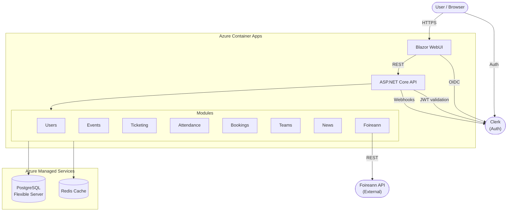
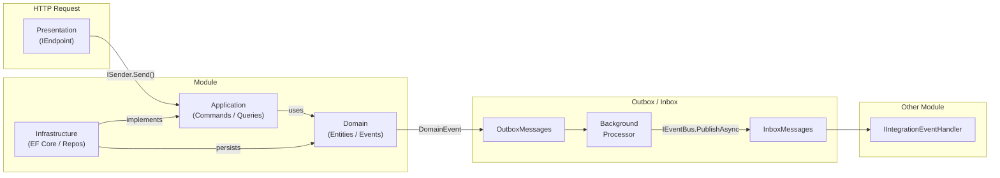

# Silverbridge Harps GFC Website

The official website for Silverbridge Harps GFC — a GAA club in County Armagh. The application handles event management, ticketing, attendance tracking, news, bookings, and club administration.

## Tech Stack

| Layer         | Technology                        |
| ------------- | --------------------------------- |
| Runtime       | .NET 10                           |
| Backend API   | ASP.NET Core Minimal APIs         |
| Frontend      | Blazor WebAssembly (MudBlazor UI) |
| Database      | PostgreSQL (per-module schemas)   |
| Cache         | Redis                             |
| Auth          | Clerk (JWT / OpenID Connect)      |
| Hosting       | Azure Container Apps              |
| Orchestration | .NET Aspire                       |

## Prerequisites

- [.NET 10 SDK](https://dotnet.microsoft.com/download)
- [Docker Desktop](https://www.docker.com/products/docker-desktop/) (for local containers via Aspire)
- A [Clerk](https://clerk.com) account with an application configured

## Getting Started

```bash
# Restore dependencies
dotnet restore

# Run locally with Aspire (spins up PostgreSQL, Redis, API, and WebUI)
dotnet run --project src/Aspire/SilverbridgeWeb.AppHost
```

The Aspire dashboard will open automatically. pgAdmin is available at `http://localhost:5050`.

### Required Parameters

The following parameters must be set before running (via `appsettings.Development.json` or environment variables):

| Parameter                      | Description                         |
| ------------------------------ | ----------------------------------- |
| `clerk-authority`              | Your Clerk issuer URL               |
| `clerk-webhook-signing-secret` | Clerk webhook signing secret        |
| `clerk-client-id`              | Clerk OIDC client ID (frontend)     |
| `clerk-client-secret`          | Clerk OIDC client secret (frontend) |
| `foireann-primary-api-key`     | Foireann API primary key            |
| `foireann-secondary-api-key`   | Foireann API secondary key          |

## Build & Test

```bash
# Build
dotnet build

# Build (Release)
dotnet build --configuration Release

# Run all tests
dotnet test

# Architecture tests only
dotnet test test/SilverbridgeWeb.ArchitectureTests

# Tests for a specific module
dotnet test src/Backend/Modules/Users/test/SilverbridgeWeb.Modules.Users.ArchitectureTests
```

## Architecture

The application is a **modular monolith** with a vertical slice architecture inside each module, deployed as a single container to Azure Container Apps.

### System Overview



### Module Internal Architecture

Each module is internally structured with Clean Architecture layers. Commands and queries flow through CQRS, and cross-module communication happens exclusively through integration events via an outbox/inbox pattern.



### Modules

| Module         | Responsibility                             |
| -------------- | ------------------------------------------ |
| **Users**      | User management and authentication         |
| **Events**     | Event creation and management              |
| **Ticketing**  | Ticket sales and management                |
| **Attendance** | Attendance tracking                        |
| **Bookings**   | Facility and resource bookings             |
| **Teams**      | Team management                            |
| **News**       | News and announcements                     |
| **Foireann**   | Integration with the Foireann GAA platform |

### Module Layer Structure

Each module follows **Clean Architecture** with layer dependencies enforced by architecture tests:

```
Module.Domain/              # Entities, value objects, domain events
Module.Application/         # Commands, queries, handlers, validators
Module.Infrastructure/      # EF Core DbContext, repositories, outbox/inbox
Module.Presentation/        # Minimal API endpoints (IEndpoint)
Module.IntegrationEvents/   # Events shared with other modules
Module.ArchitectureTests/   # NetArchTest layer boundary rules
```

**Dependency rules**: Domain ← Application ← Infrastructure, Presentation

### CQRS

All operations go through a custom `ISender` (backed by `MessageDispatcher` in `Common.Application`):

- Commands modify state and return `Result<T>`
- Queries read state and return `Result<T>` or data
- Handlers live in the `Application` layer
- Validation via `FluentValidation`

### Cross-Module Communication

Modules are isolated — they never reference each other directly. Communication uses **integration events**:

1. Aggregate raises a domain event
2. Domain event handler publishes an integration event via `IEventBus`
3. Target module consumes it via `IIntegrationEventHandler<T>` through the inbox pattern

**Outbox**: domain events → `OutboxMessages` table → background processor → `IEventBus.PublishAsync`  
**Inbox**: integration events → `InboxMessages` table → idempotent `IIntegrationEventConsumer<T>`

### Database

Each module owns its own PostgreSQL schema (e.g. `users`, `events`, `ticketing`). Migrations are per-module under `Module.Infrastructure/Database/Migrations/`.

### Common Projects

| Project                 | Contents                                               |
| ----------------------- | ------------------------------------------------------ |
| `Common.Domain`         | `Result`, `Error`, `Entity`, `DomainEvent`             |
| `Common.Application`    | `ICommand`, `IQuery`, handlers, `ISender`, `IEventBus` |
| `Common.Infrastructure` | Auth, caching, outbox/inbox, `EventBus` implementation |
| `Common.Presentation`   | `IEndpoint`, endpoint registration helpers             |

## Project Structure

```
src/
  Aspire/
    SilverbridgeWeb.AppHost/        # Aspire orchestration host
    SilverbridgeWeb.ServiceDefaults/ # Shared Aspire service defaults
  Backend/
    API/SilverbridgeWeb.Api/        # API entry point
    Common/                         # Shared Common.* projects
    Modules/                        # Feature modules
  Frontend/
    SilverbridgeWeb.WebUI/          # Blazor WebUI
test/
  SilverbridgeWeb.ArchitectureTests/ # Global architecture rules
```

## Deployment

The app is deployed to **Azure Container Apps** using the Azure Developer CLI (`azd`):

```bash
azd up
```

Configuration is defined in `azure.yaml`. Infrastructure is provisioned via .NET Aspire's Azure integration (PostgreSQL Flexible Server, Redis Cache, Container Apps).

## Key Conventions

- **IDs**: ULID stored as `Guid` — `Ulid.NewUlid().ToGuid()`
- **Namespaces**: match folder structure — `SilverbridgeWeb.Modules.{Module}.{Layer}.{Feature}`
- **Warnings as errors**: all projects — fix warnings before committing
- **Central Package Management**: all NuGet versions in `Directory.Packages.props`
- **No cross-module project references**: use integration events instead
